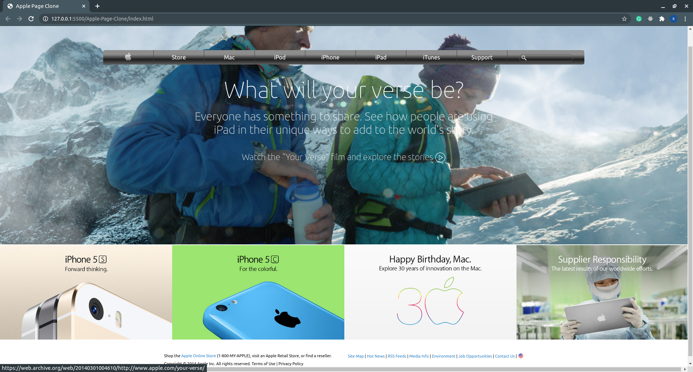

# Apple Page Clone

> This is a project for cloning an archived Apple page 
> as a learning guide .

Additional description about the project and its features.

## Built With

- HTML & CSS3,
- FlexBox, Float

## Live Demo

[Live Demo Link](https://raw.githack.com/pbkabali/Apple-Page-Clone/landing-page/index.html)

## Getting Started

To get a local copy up and running follow these simple example steps.

### Prerequisites

- Code Editor
- Web Browser

### Setup

`$git clone https://github.com/pbkabali/Apple-Page-Clone.git`

### Install

- Run a local server

### Usage

- Personal Project - The New York Times Clone

## Authors

👤 **Paul Balitema Kabali**

- Github: [@pbkabali](https://github.com/pbkabali)
- Twitter: [@pbkabali](https://twitter.com/pbkabali)
- Linkedin: [engineerbpk](https://linkedin.com/in/engineerbpk)

👤 **Sanad Walid Abujbara**

- Github: [@sanadwj](https://github.com/githubhandle)
- Twitter: [@sandooog](https://twitter.com/sandooog)
- Linkedin: [sanad-abujbara](https://linkedin.com/in/sanad-abujbara)

## 🤝 Contributing

Contributions, issues and feature requests are welcome!

Feel free to check the [issues page](https://github.com/sanadwj/Positioning-and-Floating-Elements/issues/).

## Show your support

Give a ⭐️ if you like this project!

## Acknowledgments

- Microverse Team 140 (The Cupids)
- Microverse Team 139 (The Thanatos)

## 📝 License

This project is [MIT](lic.url) licensed.